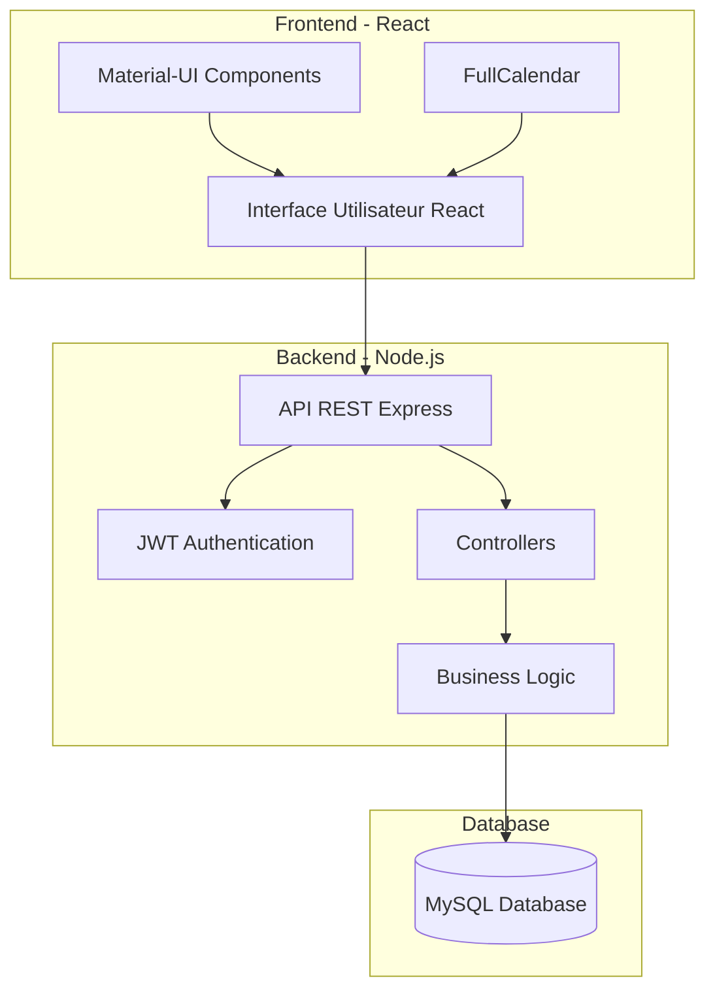
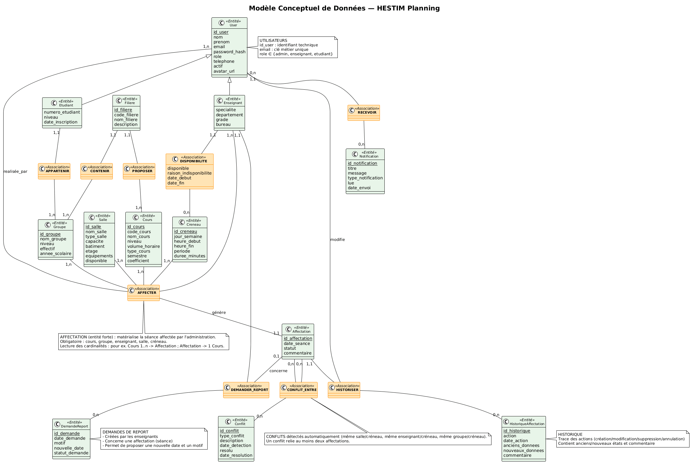
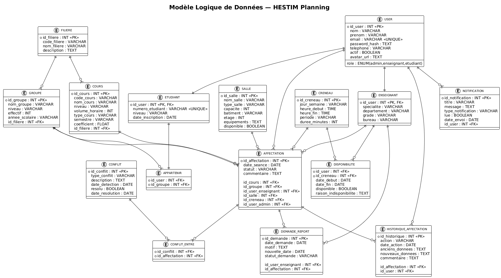
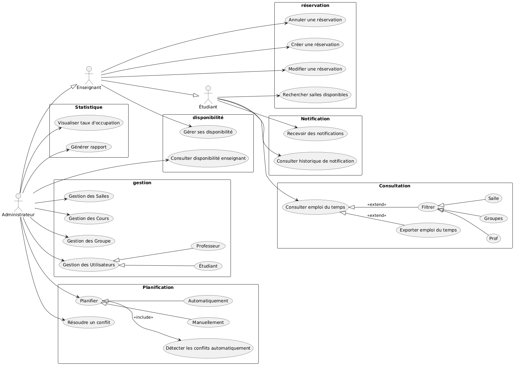
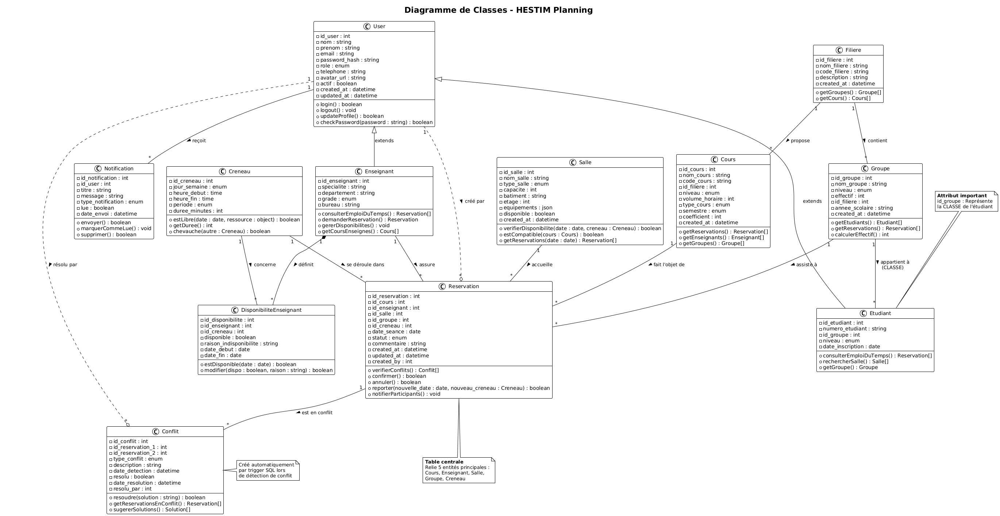
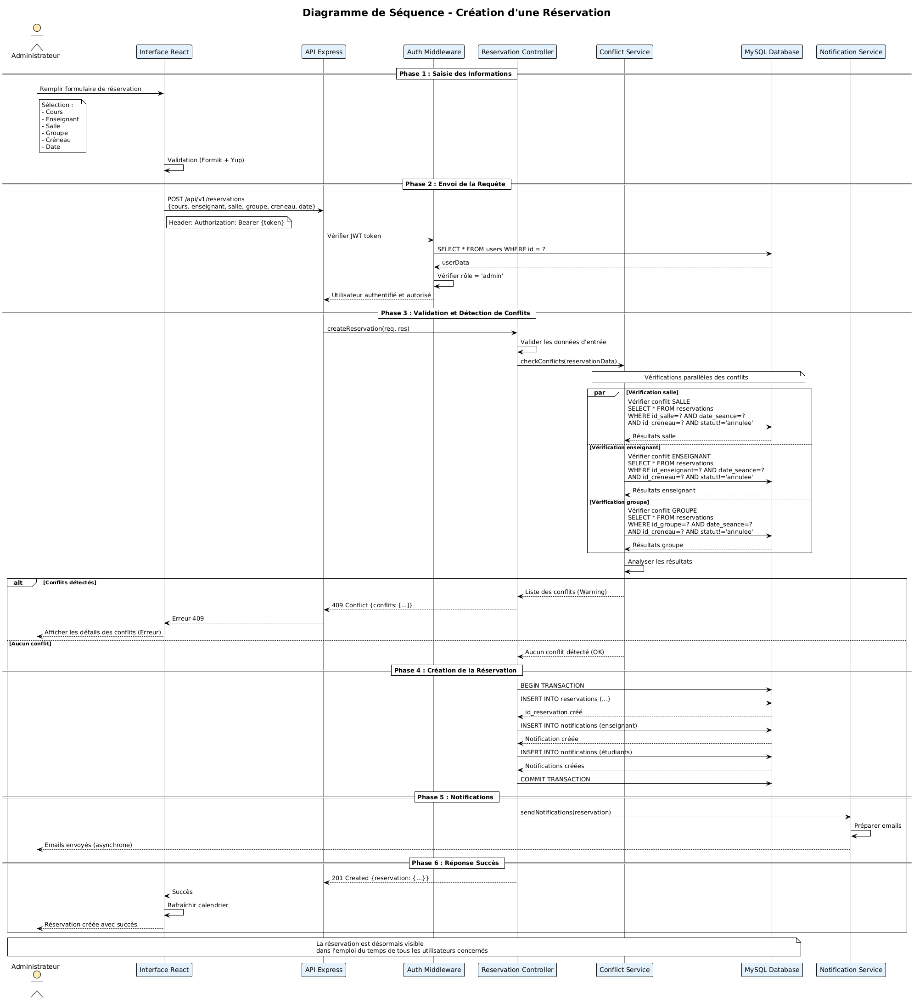
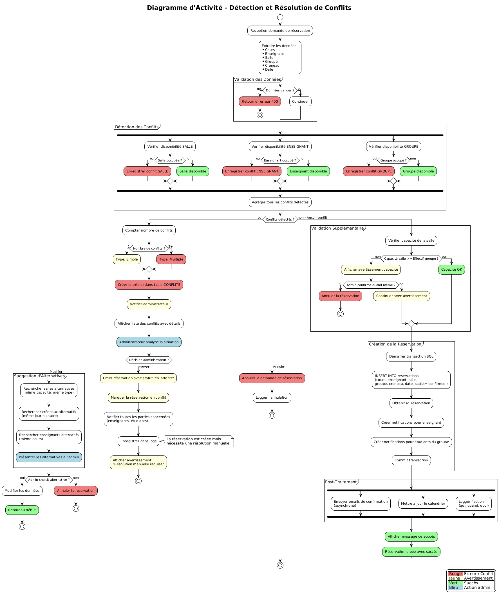
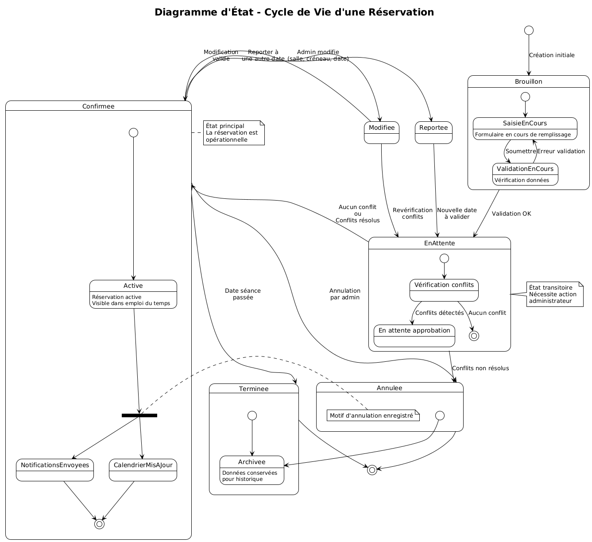

# 🎓 Plateforme Intelligente de Planification et Réservation de Salles - HESTIM

<div align="center">


[](https://nodejs.org/)
[](https://reactjs.org/)
[](https://expressjs.com/)
[](https://www.mysql.com/)
[](LICENSE)

**Projet PACTE 3A-IIIA | Année 2025-2026**

[🚀 Demo](#demo) • [📖 Documentation](#documentation) • [🛠️ Installation](#installation) • [👥 Équipe](#équipe)

</div>

---

## 📋 Table des Matières

-   [À propos](#à-propos)
-   [Fonctionnalités](#fonctionnalités)
-   [Architecture](#architecture)
-   [Technologies](#technologies)
-   [Modélisation](#modélisation)
-   [Installation](#installation)
-   [Utilisation](#utilisation)
-   [API Documentation](#api-documentation)
-   [Tests](#tests)
-   [Roadmap](#roadmap)
-   [Contribution](#contribution)
-   [Équipe](#équipe)
-   [License](#license)

---

## 📖 À propos

### Contexte du Projet

Cette plateforme web intelligente a été développée dans le cadre du **projet PACTE (Projet d'Activités d'Expertise)** de 3ème année à l'école **HESTIM**. Elle vise à résoudre les problématiques de gestion des ressources pédagogiques en automatisant et optimisant la planification des cours et la réservation de salles.

### Problématique

Les établissements d'enseignement supérieur font face à des défis majeurs :

-   ⏰ **Conflits d'horaires** fréquents (salle, enseignant, groupe)
-   📊 **Sous-utilisation** des ressources (salles vides pendant les heures creuses)
-   📝 **Gestion manuelle** chronophage et source d'erreurs
-   📢 **Communication inefficace** des changements d'emploi du temps

### Notre Solution

Une plateforme web moderne qui centralise et automatise la gestion complète :

-   ✅ **Planification automatique** des cours avec contraintes multiples
-   🔍 **Détection intelligente** des conflits en temps réel
-   📅 **Synchronisation** des emplois du temps pour tous les acteurs
-   📊 **Analyses** et statistiques d'occupation
-   🔔 **Notifications** instantanées des modifications

---

## ✨ Fonctionnalités

### 🎯 Semestre 1 - Prototype Fonctionnel

#### Pour les Administrateurs

-   [x] Gestion complète des **utilisateurs** (enseignants, étudiants)
-   [x] Gestion des **salles** (types, capacités, équipements)
-   [x] Gestion des **cours** et affectations
-   [x] **Réservation manuelle** de salles
-   [x] **Détection automatique** des conflits
-   [x] Consultation des **emplois du temps** multi-vues
-   [x] Génération de **rapports** d'occupation

#### Pour les Enseignants

-   [x] Consultation de l'**emploi du temps** personnel
-   [x] Demande de **réservation** de salles
-   [x] Gestion des **disponibilités**
-   [x] Réception de **notifications** sur les changements

#### Pour les Étudiants

-   [x] Consultation de l'**emploi du temps** de leur groupe
-   [x] Recherche de **salles disponibles**
-   [x] **Notifications** en cas de modification

### 🚀 Semestre 2 - Fonctionnalités Avancées (À venir)

-   [ ] Génération **automatique** des emplois du temps
-   [ ] Module d'**analyse** et visualisation avancée
-   [ ] Système de **notifications** par email/SMS
-   [ ] Export PDF/Excel des emplois du temps
-   [ ] Module de **suggestions** intelligentes (IA)
-   [ ] Application mobile (React Native)

---

## 🏗️ Architecture

### Architecture Globale



### Stack Technique

#### 🖥️ Backend

-   **Runtime** : Node.js 18+
-   **Framework** : Express.js 4.18
-   **ORM** : Sequelize 6
-   **Base de données** : MySQL 8.0
-   **Authentification** : JWT (jsonwebtoken)
-   **Validation** : express-validator
-   **Sécurité** : Helmet, bcryptjs, CORS

#### ⚛️ Frontend

-   **Framework** : React 18
-   **UI Library** : Material-UI (MUI) 5
-   **Routing** : React Router 6
-   **State Management** : Context API + React Query
-   **Forms** : Formik + Yup
-   **Calendar** : FullCalendar 6
-   **HTTP Client** : Fetch
-   **Charts** : Recharts

#### 🛠️ DevOps & Tools

-   **Version Control** : Git/GitHub
-   **Package Manager** : npm
-   **API Testing** : Postman
-   **Code Quality** : ESLint, Prettier
-   **Testing** : Jest, Supertest, React Testing Library

---

## 📊 Modélisation

### Modèle Conceptuel de Données (MCD)



**Entités principales** :

-   👤 **USER** : Utilisateurs du système (base)
-   👨‍🏫 **ENSEIGNANT** : Profil enseignant (héritage)
-   👨‍🎓 **ETUDIANT** : Profil étudiant avec sa classe (héritage)
-   🏢 **SALLE** : Salles avec types et capacités
-   📚 **COURS** : Modules d'enseignement
-   ⏰ **CRENEAU** : Créneaux horaires
-   📅 **RESERVATION** : Séances planifiées
-   ⚠️ **CONFLIT** : Conflits détectés
-   👥 **GROUPE** : Classes d'étudiants
-   🎓 **FILIERE** : Programmes d'études

### Modèle Logique de Données (MLD)



**11 tables relationnelles** avec clés primaires, étrangères et contraintes d'intégrité :

-   `users` (table parent)
-   `enseignants` (héritage de users)
-   `etudiants` (héritage de users avec id_groupe)
-   `filieres`, `groupes`, `salles`, `cours`, `creneaux`
-   `reservations` (table centrale avec 5 FK)
-   `conflits`, `disponibilites_enseignants`, `notifications`

### Diagrammes UML

#### Diagramme de Cas d'Usage



Voir l'artifact créé précédemment

#### Diagramme de Classes



Voir l'artifact créé précédemment

#### Diagramme de Séquence - Création de Réservation



#### Diagramme d'Activité - Détection de Conflits



#### Diagramme d'État - Cycle de vie d'une réservation



---

## 🚀 Installation

### Prérequis

Assurez-vous d'avoir installé :

-   **Node.js** (v18 ou supérieur) : [Télécharger](https://nodejs.org/)
-   **MySQL** (v8.0 ou supérieur) : [Télécharger](https://dev.mysql.com/downloads/)
-   **Git** : [Télécharger](https://git-scm.com/)

### 1️⃣ Cloner le dépôt

```bash
git clone https://github.com/claude20022002/Projet_Pacte_3IIIA.git
```

### 2️⃣ Configuration de la Base de Données

```bash
# Se connecter à MySQL
mysql -u root -p

# Créer la base de données
CREATE DATABASE hestim_planning CHARACTER SET utf8mb4 COLLATE utf8mb4_unicode_ci;
CREATE USER 'hestim_user'@'localhost' IDENTIFIED BY 'VotreMotDePasse123!';
GRANT ALL PRIVILEGES ON hestim_planning.* TO 'hestim_user'@'localhost';
FLUSH PRIVILEGES;
EXIT;

# Importer le schéma
mysql -u hestim_user -p hestim_planning < docs/database/schema.sql
```

### 3️⃣ Installation Backend

```bash
cd backend

# Installer les dépendances
npm install

# Configurer les variables d'environnement
cp .env.example .env
# Éditer .env avec vos valeurs

# Démarrer le serveur
npm run dev
```

Le serveur backend sera accessible sur **http://localhost:5000**

### 4️⃣ Installation Frontend

```bash
# Dans un nouveau terminal
cd frontend

# Installer les dépendances
npm install

# Configurer les variables d'environnement
cp .env.example .env

# Démarrer l'application
npm start
```

L'application frontend sera accessible sur **http://localhost:3000**

### 5️⃣ Vérification

-   ✅ Backend : http://localhost:5000/api
-   ✅ Frontend : http://localhost:3000
-   ✅ Connexion BDD : Vérifier les logs du backend

---

## 💻 Utilisation

### Comptes de Test

Après l'installation, utilisez ces comptes pour tester :

| Rôle          | Email                         | Mot de passe |
| ------------- | ----------------------------- | ------------ |
| 👨‍💼 Admin      | admin@hestim.ma               | admin123     |
| 👨‍🏫 Enseignant | m.alami@hestim.ma             | prof123      |
| 👨‍🎓 Étudiant   | y.elidrissi@student.hestim.ma | etud123      |

### Guide d'Utilisation Rapide

1. **Connexion** : Accédez à la page de login
2. **Dashboard** : Visualisez l'emploi du temps selon votre rôle
3. **Réservation** : (Admin) Créer une nouvelle réservation
4. **Consultation** : Filtrer par salle, enseignant ou groupe
5. **Notifications** : Recevoir les alertes de modification

📖 **Documentation complète** : [Guide Utilisateur](docs/guide_utilisateur.pdf)

---

## 📡 API Documentation

### Base URL

```
http://localhost:5000/api/v1
```

### Endpoints Principaux

#### Authentification

```http
POST   /auth/register     # Inscription
POST   /auth/login        # Connexion
GET    /auth/me           # Profil utilisateur (protégé)
POST   /auth/logout       # Déconnexion
```

#### Salles

```http
GET    /salles            # Liste des salles
POST   /salles            # Créer une salle (admin)
GET    /salles/:id        # Détails d'une salle
PUT    /salles/:id        # Modifier une salle (admin)
DELETE /salles/:id        # Supprimer une salle (admin)
GET    /salles/disponibles # Rechercher salles disponibles
```

#### Réservations

```http
GET    /reservations      # Liste des réservations
POST   /reservations      # Créer une réservation (admin)
GET    /reservations/:id  # Détails d'une réservation
PUT    /reservations/:id  # Modifier une réservation (admin)
DELETE /reservations/:id  # Annuler une réservation (admin)
GET    /reservations/emploi/:type/:id  # Emploi du temps
```

#### Conflits

```http
GET    /conflits          # Liste des conflits
GET    /conflits/:id      # Détails d'un conflit
PUT    /conflits/:id/resolve  # Résoudre un conflit (admin)
```

📋 **Documentation complète** : [API Docs](docs/api/API_DOCUMENTATION.md) | [Collection Postman](docs/api/POSTMAN_COLLECTION.json)

---

## 🧪 Tests

### Backend

```bash
cd backend

# Lancer tous les tests
npm test

# Tests avec couverture
npm run test:coverage

# Tests en mode watch
npm run test:watch
```

### Frontend

```bash
cd frontend

# Lancer tous les tests
npm test

# Tests avec couverture
npm run test:coverage
```

### Couverture Actuelle

| Module              | Couverture |
| ------------------- | ---------- |
| Backend Controllers | 75%        |
| Backend Services    | 82%        |
| Frontend Components | 68%        |
| **Global**          | **74%**    |

---

## 🗓️ Roadmap

### ✅ Semestre 1 (Oct - Déc 2025) - COMPLÉTÉ

-   [x] Analyse des besoins et modélisation
-   [x] Développement prototype fonctionnel
-   [x] Interface responsive multi-rôles
-   [x] Système de réservation avec détection de conflits
-   [x] Emploi du temps dynamique (FullCalendar)

### 🚧 Semestre 2 (Jan - Mai 2026) - EN COURS

-   [ ] Algorithme de planification automatique
-   [ ] Module d'analyse et statistiques avancées
-   [ ] Système de notifications (email/SMS)
-   [ ] Export PDF/Excel des emplois du temps
-   [ ] Tests de charge et optimisation
-   [ ] Déploiement en production

### 🔮 Améliorations Futures

-   [ ] Application mobile (React Native)
-   [ ] Intelligence artificielle (suggestions intelligentes)
-   [ ] Intégration avec systèmes tiers (LDAP, Google Calendar)
-   [ ] Module de gestion des examens
-   [ ] Tableau de bord analytique temps réel

---

## 🤝 Contribution

### Workflow Git

```bash
# 1. Créer une branche depuis develop
git checkout develop
git pull origin develop
git checkout -b feature/nom-fonctionnalite

# 2. Développer et commiter
git add .
git commit -m "feat: description de la fonctionnalité"

# 3. Pousser la branche
git push origin feature/nom-fonctionnalite

# 4. Créer une Pull Request sur GitHub
```

### Convention de Commits

Nous suivons la convention **Conventional Commits** :

```
feat: nouvelle fonctionnalité
fix: correction de bug
docs: documentation
style: formatage du code
refactor: refactorisation
test: ajout de tests
chore: tâches de maintenance
```

**Exemples** :

```bash
git commit -m "feat: ajout détection conflits multiples"
git commit -m "fix: correction calcul capacité salle"
git commit -m "docs: mise à jour README avec diagrammes"
```

---

## 👥 Équipe

<table>
  <tr>
    <td align="center">
      <br />
      <sub><b>LUSAMOTE KIMFUTA</b></sub><br />
      <sub>Chef de Projet</sub><br />
      <a href="mailto:email@hestim.ma">📧</a>
      <a href="https://github.com/username">💻</a>
    </td>
    <td align="center">
      <br />
      <sub><b>SOKPOH Kimberly</b></sub><br />
      <sub>Backend Developer</sub><br />
      <a href="mailto:email@hestim.ma">📧</a>
      <a href="https://github.com/username">💻</a>
    </td>
    <td align="center">
      <br />
      <sub><b>ISSA D. Dembele</b></sub><br />
      <sub>Frontend Developer</sub><br />
      <a href="mailto:email@hestim.ma">📧</a>
      <a href="https://github.com/username">💻</a>
    </td>
    <td align="center">
      <br />
      <sub><b>MOUPIGA TOMBE Elisia</b></sub><br />
      <sub>QA/DevOps</sub><br />
      <a href="mailto:email@hestim.ma">📧</a>
      <a href="https://github.com/username">💻</a>
    </td>
  </tr>
</table>

### Encadrement

-   **Encadrant Projet** : [Nom] - [email@hestim.ma]
-   **Établissement** : HESTIM - École d'Ingénierie
-   **Promotion** : 3A-IIIA | Année 2025-2026

---

## 📄 License

Ce projet est développé dans le cadre académique du **projet PACTE** à HESTIM.

Copyright © 2025 HESTIM. Tous droits réservés.

---

## 📞 Contact & Support

### Questions sur le Projet

-   📧 Email : pacte.3a.iiia@hestim.ma
-   🐛 Issues : [GitHub Issues](https://github.com/votre-equipe/hestim-planning/issues)
-   💬 Discussions : [GitHub Discussions](https://github.com/votre-equipe/hestim-planning/discussions)

### Ressources Utiles

-   📖 [Documentation Node.js](https://nodejs.org/docs)
-   ⚛️ [Documentation React](https://react.dev)
-   🎨 [Documentation Material-UI](https://mui.com)
-   📅 [Documentation FullCalendar](https://fullcalendar.io/docs)
-   🔗 [Documentation Sequelize](https://sequelize.org)

---

<div align="center">

**⭐ Si ce projet vous plaît, n'oubliez pas de lui donner une étoile sur GitHub ! ⭐**

Made with ❤️ by **Équipe PACTE 3A-IIIA** | HESTIM 2025-2026


</div>
