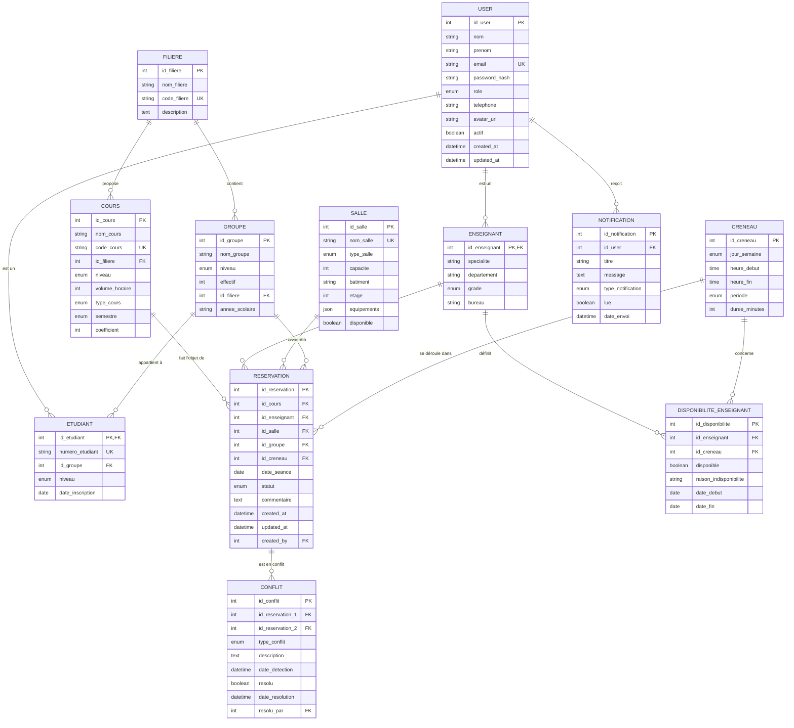

# Projet_Pacte_3IIIA

Une plateforme web intelligente pour la gestion des ressources à HESTIM.

# HESTIM Planner – Plateforme de gestion et planification des cours


## 🎯 Objectif

Application web intelligente permettant de planifier automatiquement les cours, gérer les réservations de salles, et synchroniser les emplois du temps enseignants/étudiants.

## 🚀 Fonctionnalités principales

-   Gestion des salles, enseignants, cours et groupes.
-   Réservation et planification automatique avec détection des conflits.
-   Consultation des emplois du temps consolidés.
-   Interface web responsive et ergonomique.

## 🧩 Technologies

-   Frontend : React.js + Mui JS
-   Backend : Node (JavaScript + express + sequelize)
-   Base de données : MySQL
-   Outils : GitHub

## 🏗️ Structure complète du projet

```
hestim-planning/
├── backend/ # API Node.js + Express
│ ├── config/
│ │ ├── database.js # Configuration Sequelize
│ │ ├── auth.js # Configuration JWT
│ │ └── env.js # Variables d'environnement
│ │
│ ├── models/ # Modèles Sequelize
│ │ ├── index.js # Association des modèles
│ │ ├── User.js
│ │ ├── Enseignant.js
│ │ ├── Etudiant.js
│ │ ├── Groupe.js
│ │ ├── Filiere.js
│ │ ├── Salle.js
│ │ ├── Cours.js
│ │ ├── Creneau.js
│ │ ├── Reservation.js
│ │ ├── Conflit.js
│ │ └── Notification.js
│ │
│ ├── controllers/ # Logique métier
│ │ ├── authController.js # Login, register, logout
│ │ ├── userController.js # CRUD utilisateurs
│ │ ├── salleController.js # CRUD salles
│ │ ├── coursController.js # CRUD cours
│ │ ├── reservationController.js # CRUD réservations
│ │ ├── conflitController.js # Détection/résolution conflits
│ │ ├── emploiController.js # Génération emplois du temps
│ │ └── statsController.js # Statistiques (S2)
│ │
│ ├── routes/ # Routes API
│ │ ├── index.js # Routeur principal
│ │ ├── auth.routes.js
│ │ ├── user.routes.js
│ │ ├── salle.routes.js
│ │ ├── cours.routes.js
│ │ ├── reservation.routes.js
│ │ ├── conflit.routes.js
│ │ └── emploi.routes.js
│ │
│ ├── middlewares/ # Middlewares Express
│ │ ├── authMiddleware.js # Vérification JWT
│ │ ├── roleMiddleware.js # Vérification rôles
│ │ ├── errorHandler.js # Gestion erreurs
│ │ ├── validator.js # Validation données
│ │ └── logger.js # Logs requêtes
│ │
│ ├── services/ # Services métier
│ │ ├── conflictService.js # Algorithme détection conflits
│ │ ├── scheduleService.js # Génération emploi du temps (S2)
│ │ ├── emailService.js # Envoi emails (S2)
│ │ └── notificationService.js # Gestion notifications
│ │
│ ├── utils/ # Utilitaires
│ │ ├── hashPassword.js # Bcrypt
│ │ ├── generateToken.js # JWT
│ │ ├── dateHelper.js # Manipulation dates
│ │ └── validators.js # Validateurs personnalisés
│ │
│ ├── seeders/ # Données de test
│ │ ├── 01-filieres.js
│ │ ├── 02-groupes.js
│ │ ├── 03-users.js
│ │ ├── 04-salles.js
│ │ ├── 05-cours.js
│ │ └── 06-creneaux.js
│ │
│ ├── tests/ # Tests unitaires/intégration
│ │ ├── unit/
│ │ │ ├── models/
│ │ │ ├── controllers/
│ │ │ └── services/
│ │ └── integration/
│ │ ├── auth.test.js
│ │ ├── reservation.test.js
│ │ └── conflit.test.js
│ │
│ ├── .env.example # Template variables d'environnement
│ ├── .gitignore
│ ├── package.json
│ ├── package-lock.json
│ ├── server.js # Point d'entrée serveur
│ └── README.md
│
├── frontend/ # Application React
│ ├── public/
│ │ ├── index.html
│ │ ├── favicon.ico
│ │ └── manifest.json
│ │
│ ├── src/
│ │ ├── api/ # Services API
│ │ │ ├── fetchConfig.js # Configuration fetch
│ │ │ ├── authApi.js # API Authentification
│ │ │ ├── salleApi.js
│ │ │ ├── coursApi.js
│ │ │ ├── reservationApi.js
│ │ │ └── emploiApi.js
│ │ │
│ │ ├── components/ # Composants réutilisables
│ │ │ ├── common/ # Composants communs
│ │ │ │ ├── Navbar.jsx
│ │ │ │ ├── Sidebar.jsx
│ │ │ │ ├── Footer.jsx
│ │ │ │ ├── Loader.jsx
│ │ │ │ ├── ErrorBoundary.jsx
│ │ │ │ └── ConfirmDialog.jsx
│ │ │ │
│ │ │ ├── forms/ # Formulaires
│ │ │ │ ├── LoginForm.jsx
│ │ │ │ ├── SalleForm.jsx
│ │ │ │ ├── CoursForm.jsx
│ │ │ │ └── ReservationForm.jsx
│ │ │ │
│ │ │ ├── calendar/ # Composants calendrier
│ │ │ │ ├── WeekView.jsx
│ │ │ │ ├── MonthView.jsx
│ │ │ │ ├── DayView.jsx
│ │ │ │ └── EventCard.jsx
│ │ │ │
│ │ │ └── tables/ # Tableaux de données
│ │ │ ├── SalleTable.jsx
│ │ │ ├── CoursTable.jsx
│ │ │ └── ReservationTable.jsx
│ │ │
│ │ ├── pages/ # Pages principales
│ │ │ ├── auth/
│ │ │ │ ├── Login.jsx
│ │ │ │ └── ForgotPassword.jsx
│ │ │ │
│ │ │ ├── dashboard/
│ │ │ │ ├── AdminDashboard.jsx
│ │ │ │ ├── EnseignantDashboard.jsx
│ │ │ │ └── EtudiantDashboard.jsx
│ │ │ │
│ │ │ ├── salles/
│ │ │ │ ├── SalleList.jsx
│ │ │ │ ├── SalleDetails.jsx
│ │ │ │ └── SalleCreate.jsx
│ │ │ │
│ │ │ ├── cours/
│ │ │ │ ├── CoursList.jsx
│ │ │ │ └── CoursCreate.jsx
│ │ │ │
│ │ │ ├── reservations/
│ │ │ │ ├── ReservationList.jsx
│ │ │ │ ├── ReservationCreate.jsx
│ │ │ │ └── ReservationCalendar.jsx
│ │ │ │
│ │ │ ├── conflits/
│ │ │ │ └── ConflitList.jsx
│ │ │ │
│ │ │ ├── emploi/
│ │ │ │ ├── EmploiEnseignant.jsx
│ │ │ │ ├── EmploiEtudiant.jsx
│ │ │ │ └── EmploiSalle.jsx
│ │ │ │
│ │ │ └── profile/
│ │ │ └── ProfilePage.jsx
│ │ │
│ │ ├── contexts/ # Context API React
│ │ │ ├── AuthContext.jsx # État authentification
│ │ │ ├── ThemeContext.jsx # Thème clair/sombre
│ │ │ └── NotificationContext.jsx
│ │ │
│ │ ├── hooks/ # Custom Hooks
│ │ │ ├── useAuth.js
│ │ │ ├── useDebounce.js
│ │ │ ├── useLocalStorage.js
│ │ │ └── useFetch.js
│ │ │
│ │ ├── routes/ # Configuration routes
│ │ │ ├── AppRoutes.jsx # Routes principales
│ │ │ ├── PrivateRoute.jsx # Route protégée
│ │ │ └── RoleRoute.jsx # Route par rôle
│ │ │
│ │ ├── styles/ # Styles CSS
│ │ │ ├── theme.js # Thème MUI personnalisé
│ │ │ ├── global.css
│ │ │ └── variables.css
│ │ │
│ │ ├── utils/ # Utilitaires frontend
│ │ │ ├── formatDate.js
│ │ │ ├── formatters.js
│ │ │ ├── constants.js
│ │ │ └── helpers.js
│ │ │
│ │ ├── App.jsx # Composant racine
│ │ ├── index.jsx # Point d'entrée
│ │ └── setupTests.js # Configuration tests
│ │
│ ├── .env.example
│ ├── .gitignore
│ ├── package.json
│ ├── package-lock.json
│ └── README.md
│
├── docs/ # Documentation projet
│ ├── api/
│ │ ├── API_DOCUMENTATION.md # Documentation API REST
│ │ └── POSTMAN_COLLECTION.json
│ │
│ ├── database/
│ │ ├── schema.sql # Schéma SQL
│ │ ├── MCD.png # Modèle Conceptuel
│ │ └── MLD.png # Modèle Logique
│ │
│ ├── architecture/
│ │ ├── ARCHITECTURE.md # Architecture système
│ │ └── TECH_STACK.md
│ │
│ ├── maquettes/
│ │ ├── wireframes/ # Wireframes Figma
│ │ └── mockups/ # Maquettes haute-fidélité
│ │
│ └── rapports/
│ ├── cahier_des_charges.pdf
│ ├── rapport_mi_parcours.pdf
│ └── rapport_final_s1.pdf
│
├── scripts/ # Scripts utilitaires
│ ├── init-database.sh # Initialisation BDD
│ ├── seed-data.sh # Insertion données test
│ └── backup-db.sh # Backup BDD
│
├── .gitignore # Fichiers ignorés Git
├── README.md # Documentation principale
├── docker-compose.yml # Configuration Docker (optionnel)
└── package.json # Scripts globaux (optionnel)
```

## 📊 Structure de la base de données

### Schéma relationnel

```markdown
### 🗺️ Légende

-   🔹 **PK** : clé primaire
-   🔸 **FK** : clé étrangère
-   🧩 Les relations 1–N sont indiquées par `||--o{`
-   📚 Généré avec [Mermaid ER Diagram](https://mermaid.js.org/syntax/entityRelationshipDiagram.html)
```



## 🧠 Organisation

Le projet est géré via GitHub :

-   Une branche principale `main`
-   Une branche par fonctionnalité (`feature/nom-fonction`)
-   Pull Requests pour validation avant fusion
-   Suivi des tâches via Trello (kanban)

## 📆 Semestre 1 – Objectifs

-   Analyse du besoin et modélisation
-   Conception du modèle de données
-   Prototype local fonctionnel (réservations + détection conflits)

# plan_B_projet_PACTE
