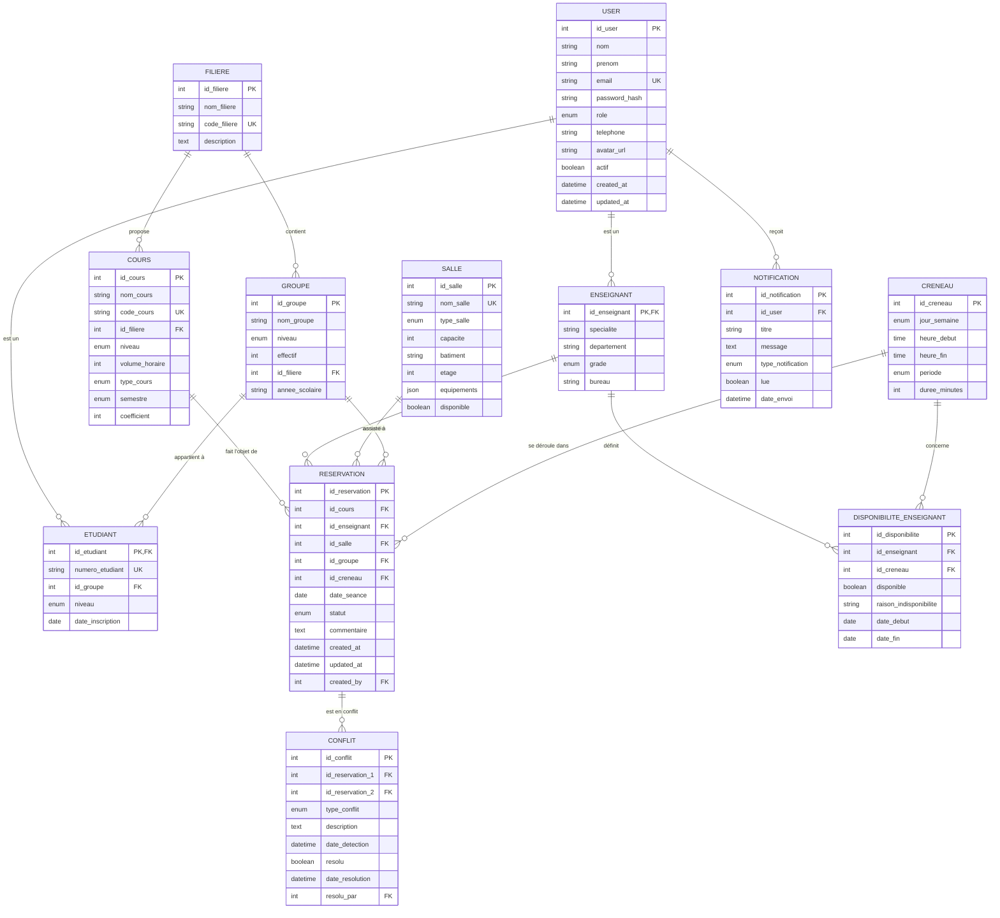
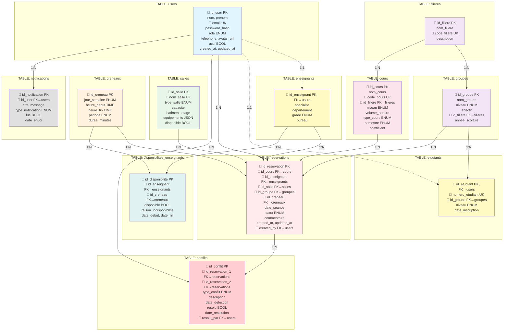

# 📊 Codes Mermaid Complets pour Export

Copiez ces codes dans https://mermaid.live/ pour générer les images.

---

```markdown
### 🗺️ Légende

-   🔹 **PK** : clé primaire
-   🔸 **FK** : clé étrangère
-   🧩 Les relations 1–N sont indiquées par `||--o{`
-   📚 Généré avec [Mermaid ER Diagram](https://mermaid.js.org/syntax/entityRelationshipDiagram.html)
```

## 1️⃣ MCD - Modèle Conceptuel de Données



**Fichier à créer** : `docs/database/MCD.png`

---

## 2️⃣ MLD - Modèle Logique de Données



**Fichier à créer** : `docs/database/MLD.svg`

---

## 3️⃣ Diagramme de Cas d'Usage

(Utilisez le diagramme déjà créé dans l'artifact `uml_use_case`)

**Fichier à créer** : `docs/uml/use_case.png`

---

## 4️⃣ Diagramme de Classes

(Utilisez le diagramme déjà créé dans l'artifact `uml_class`)

**Fichier à créer** : `docs/uml/class_diagram.png`

---

## 5️⃣ Diagramme de Séquence - Création Réservation

(Code complet dans l'artifact `uml_sequence_reservation`)

**Fichier à créer** : `docs/uml/sequence_reservation.png`

---

## 6️⃣ Diagramme d'Activité - Détection Conflits

(Code complet dans l'artifact `uml_activity_conflict`)

**Fichier à créer** : `docs/uml/activity_conflict.png`

---

## 📝 Instructions Rapides

1. Aller sur **https://mermaid.live/**
2. Copier le code d'un diagramme ci-dessus
3. Coller dans l'éditeur
4. Cliquer sur **Actions** → **PNG**
5. Télécharger et renommer selon le nom de fichier indiqué
6. Placer dans le dossier approprié de votre projet

---

## 🎨 Paramètres d'Export Recommandés

-   **Format** : PNG
-   **Largeur** : 1920px (ou laisser automatique)
-   **Fond** : Transparent ou blanc
-   **Qualité** : Maximum

---

**Tous vos diagrammes seront prêts pour le README et les rapports ! 📊**
