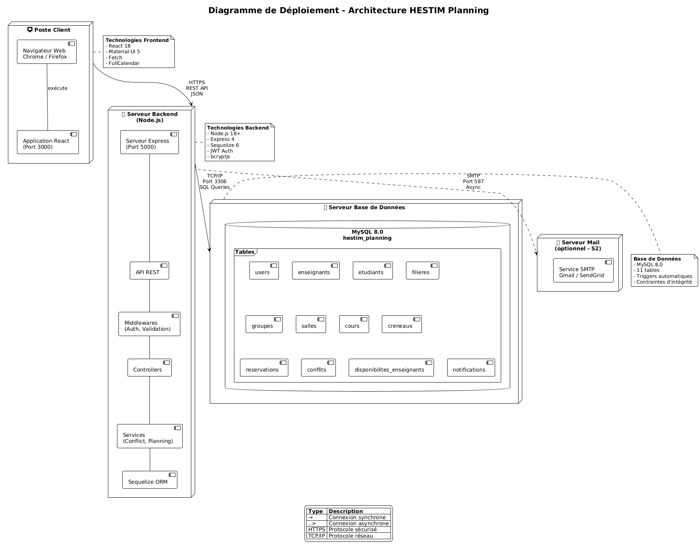
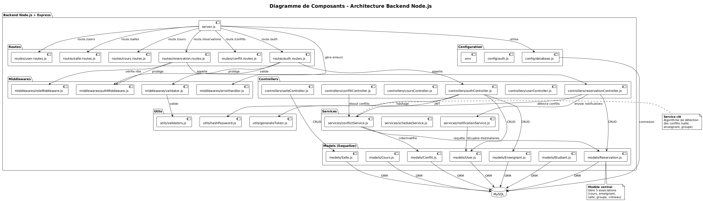

# 🧱 Architecture du Projet HESTIM Planning

## 🏫 Projet : Plateforme de Planification HESTIM

**Objectif :** gérer et optimiser la réservation des cours, des salles et des emplois du temps pour les enseignants et étudiants de l'HESTIM.

## ⚙️ 1. Vue d'Ensemble de l'Architecture

Le système repose sur une architecture **3-tiers** moderne :

-   **Frontend (React.js)** : interface utilisateur accessible via navigateur web
-   **Backend (Node.js + Express + Sequelize)** : logique métier et API REST
-   **Base de Données (MySQL)** : stockage relationnel structuré et sécurisé

## 🌍 2. Diagramme de Déploiement — Infrastructure Technique

### 🎯 Rôle

Ce diagramme illustre la répartition physique et logique des composants du système HESTIM Planning sur les différents serveurs et clients.

### 🧠 Description des nœuds

#### 💻 Poste Client

-   **Navigateur web** (Chrome / Firefox)
-   **Application React** (port 3000)
-   **Communication** via HTTPS (JSON)
-   **Librairies principales** : React 18, Material-UI, Fetch, FullCalendar, Formik

#### 🖥️ Serveur Backend

-   **Node.js 18+**
-   **Framework** : Express.js
-   **ORM** : Sequelize
-   **Authentification** : JWT + bcrypt

**Structure modulaire :**

-   API REST
-   Controllers
-   Services (détection de conflits, notifications)
-   Middlewares (auth, validation, rôles)
-   ORM Sequelize (mapping BDD)

#### 💾 Serveur Base de Données

-   **MySQL 8.0** (`hestim_planning`)
-   **11 tables relationnelles** avec :
    -   Contraintes d'intégrité
    -   Clés étrangères
    -   Triggers automatiques pour détection de conflits

#### 📧 Serveur Mail (optionnel)

-   **Service SMTP** (Gmail / SendGrid)
-   Utilisé pour notifications automatiques asynchrones

### 💡 Intérêt

Ce diagramme montre comment chaque partie du système communique (HTTP, TCP/IP, SMTP) et comment la sécurité et la modularité sont assurées.

## 🧩 3. Diagramme de Composants — Architecture du Backend

### 🎯 Rôle

Il décrit la structure interne du serveur Node.js, organisée en modules indépendants et interconnectés.

### 🧠 Structure logique

#### 📦 Serveur principal

-   **`server.js`** : point d'entrée de l'application (Express)
-   Charge les routes, middlewares, connexion à la BDD et gestion globale des erreurs

#### ⚙️ Configuration

-   **`config/database.js`** → connexion Sequelize (MySQL)
-   **`config/auth.js`** → gestion JWT
-   **`.env`** → variables d'environnement

#### 🚏 Routes

-   Fichiers regroupés par ressource : `auth.routes.js`, `salle.routes.js`, `reservation.routes.js`…
-   Chaque route appelle un controller et applique les middlewares nécessaires (auth, rôle, validation)

#### 🧰 Middlewares

-   **`authMiddleware.js`** → vérifie le JWT
-   **`roleMiddleware.js`** → contrôle les autorisations
-   **`validator.js`** → valide les entrées
-   **`errorHandler.js`** → centralise la gestion des erreurs

#### 🧠 Controllers

-   Logique métier par ressource (auth, utilisateurs, réservations, conflits)
-   Appellent les services ou les modèles selon le besoin

#### 🔧 Services

-   **`conflictService.js`** → détection de conflits (salles, enseignants, groupes)
-   **`scheduleService.js`** → planification automatique
-   **`notificationService.js`** → envoi d'emails et notifications internes

#### 🗃️ Models Sequelize

-   Représentent les tables de la base (User, Reservation, Conflit, etc.)
-   Gèrent les relations (associations `belongsTo`, `hasMany`…)

#### 🧮 Utils

-   Fonctions utilitaires : hashage, génération de token, validation personnalisée

### 💡 Intérêt

Ce découpage rend le code :

-   **Lisible** (chaque fichier a un rôle précis)
-   **Testable** (chaque couche est isolée)
-   **Évolutif** (nouveaux services/entités faciles à ajouter)

## 🖼️ 4. Diagramme de Paquetages — Organisation du Frontend React

### 🎯 Rôle

Ce diagramme représente la structure modulaire du frontend React, facilitant la maintenance et la réutilisation des composants.

### 🧠 Organisation par dossiers

#### 📂 `src/api/`

-   Centralise les appels Fetch vers l'API Express
-   Inclut les fichiers : `authApi.js`, `salleApi.js`, `reservationApi.js`…
-   Gère les intercepteurs JWT et les erreurs réseau

#### 🧩 `src/components/`

Contient tous les composants réutilisables :

-   **`common/`** → navbar, sidebar, footer, loader
-   **`forms/`** → formulaires de saisie (Formik + Yup)
-   **`calendar/`** → vues calendrier (FullCalendar)
-   **`tables/`** → tableaux de données

#### 📄 `src/pages/`

Contient les pages principales :

-   **Authentification** : Login, ForgotPassword
-   **Dashboards** : admin, enseignant, étudiant
-   **Réservations et salles** : création, affichage, détails

#### 🔁 `src/contexts/`

Utilise la Context API pour la gestion globale :

-   Authentification (`AuthContext`)
-   Thème (`ThemeContext`)
-   Notifications (`NotificationContext`)

#### ⚙️ `src/hooks/`

-   Hooks personnalisés (`useAuth`, `useFetch`, `useDebounce`) pour factoriser la logique répétitive

#### 🚦 `src/routes/`

-   Configuration du routage avec React Router v6
-   `PrivateRoute` et `RoleRoute` protègent l'accès selon le rôle utilisateur

#### 🎨 `src/styles/`

-   Fichiers de thème et de style global (`theme.js`, `global.css`)
-   Intégration Material-UI avec support mode clair/sombre

#### 🧰 `src/utils/`

-   Fonctions utilitaires globales : formatage de dates, constantes, helpers

#### 🪄 Entrée principale

-   **`index.jsx`** : point d'entrée du projet
-   **`App.jsx`** : configuration globale, routes et providers de contexte

### 💡 Intérêt

Cette architecture favorise :

-   La séparation des responsabilités (logique, UI, data)
-   La réutilisation des composants
-   Une meilleure maintenabilité et évolutivité du code React

## 🔗 5. Interaction Frontend ↔ Backend ↔ Base de Données

| Couche                   | Technologie                        | Rôle principal                       |
| ------------------------ | ---------------------------------- | ------------------------------------ |
| Frontend (React)         | Fetch / React Router / Material-UI | Interface utilisateur, appels API    |
| Backend (Node + Express) | JWT / Controllers / Services       | Traitement métier et sécurité        |
| Base de Données (MySQL)  | Sequelize ORM                      | Persistance et intégrité des données |

### Flux général

1. Le frontend envoie une requête HTTP (`POST /api/reservations`) → Backend
2. Express vérifie le JWT, applique les middlewares → Controller
3. Le Controller appelle le Service (ex. : `ConflictService`) → ORM → MySQL
4. Le backend renvoie la réponse JSON → Frontend met à jour l'interface

## 🧩 6. Synthèse Globale

| Diagramme           | Type            | Objectif                                              |
| ------------------- | --------------- | ----------------------------------------------------- |
| Déploiement         | Physique        | Représenter l'infrastructure et les connexions réseau |
| Composants Backend  | Logique         | Décrire l'organisation du serveur Node.js             |
| Paquetages Frontend | Organisationnel | Visualiser la structure du projet React               |

### 💬 Cohérence

Ces trois diagrammes se complètent :

-   Le **déploiement** montre où chaque élément s'exécute
-   Les **composants backend** montrent comment le serveur fonctionne
-   Les **paquetages frontend** montrent comment l'interface est organisée

---

Ensemble, ils forment une vision complète de l'architecture du système HESTIM Planning, depuis l'infrastructure matérielle jusqu'à l'organisation du code source.
