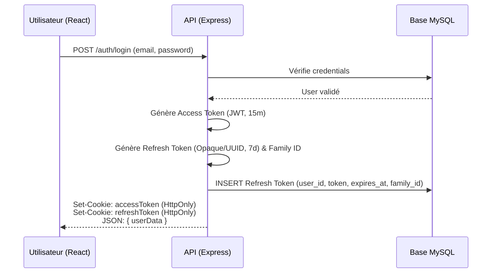
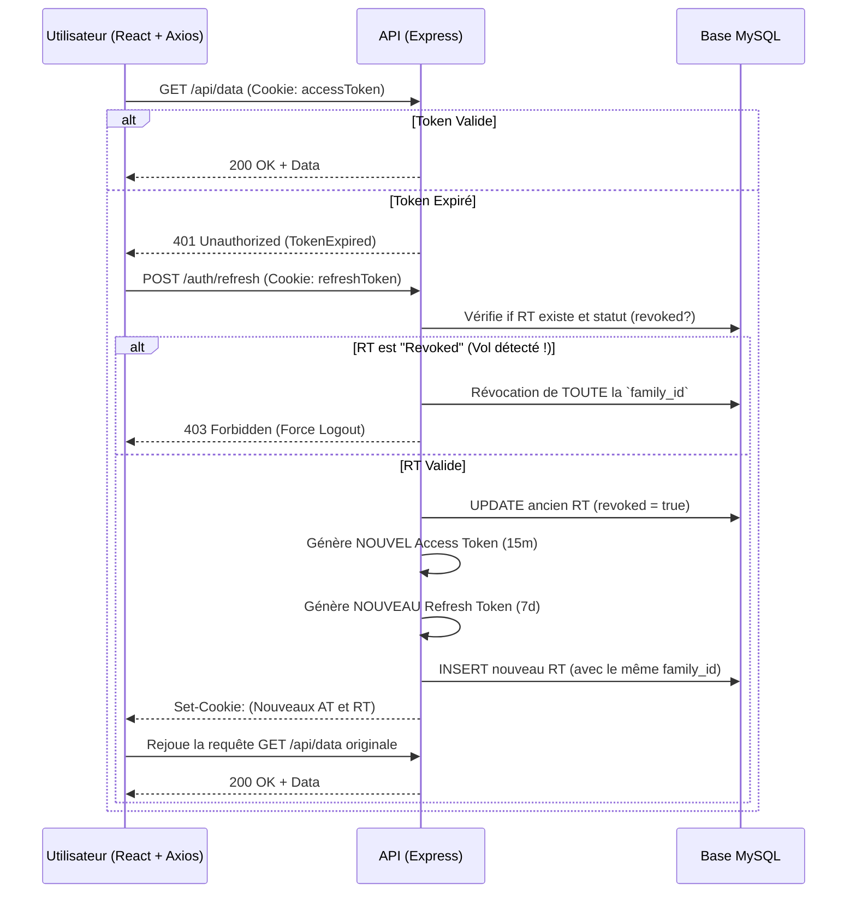

# Architecture d'Authentification Sécurisée JWT (Production-Grade)

## 1. Stratégie Globale et Principes de Sécurité

La migration d'un stockage `localStorage` vers une architecture sécurisée (grade production) résout des vulnérabilités majeures (comme les attaques XSS) et améliore la gestion du cycle de vie des sessions. Elle repose sur les principes suivants :

1.  **Access Token (AT)** : Stocké dans un cookie `HttpOnly`, `Secure`, `SameSite=Strict`. Durée de vie très courte (ex: 15 minutes). Il est "stateless" (non stocké en base de données, l'API le vérifie cryptographiquement).
2.  **Refresh Token (RT)** : Stocké dans un cookie `HttpOnly`, `Secure`, `SameSite=Strict` ou un path dédié (ex: `/api/auth/refresh`). Durée de vie longue (ex: 7 jours). Il est "stateful" (stocké dans MySQL) pour permettre le suivi des sessions et la révocation.
3.  **Rotation des Refresh Tokens (Refresh Token Rotation)** : Chaque fois qu'un RT est utilisé pour générer un nouvel AT, un nouveau RT est également émis, et l'ancien est invalidé. Si un RT invalidé est réutilisé (tentative de rejeu), c'est une preuve de vol, et **tous** les RT de la même famille (session) sont révoqués.
4.  **Protection CSRF** : Puisque nous utilisons des cookies, nous sommes potentiellement vulnérables au CSRF. La configuration `SameSite=Strict` protège la majorité des cas pour une SPA. Pour une API sur un domaine différent (CORS), on utilise l'en-tête natif de contenu (ex: interdire form-urlencoded) ou le pattern "Double Submit Cookie" (ou une librairie CSRF Express).
5.  **Multi-Device** : Chaque login génère une nouvelle "session" (une nouvelle ligne dans la table des refresh tokens), ce qui permet d'être connecté sur plusieurs appareils simultanément et de les révoquer de manière unitaire.

---

## 2. Modèle de Données (MySQL)

Il nous faut une table dédiée pour gérer l'état et l'historique des Refresh Tokens afin de pouvoir les révoquer et gérer les appareils multiples.

```sql
CREATE TABLE users (
    id VARCHAR(36) PRIMARY KEY,
    email VARCHAR(255) UNIQUE NOT NULL,
    password_hash VARCHAR(255) NOT NULL,
    -- autres champs métiers (nom, role, etc.)
    created_at TIMESTAMP DEFAULT CURRENT_TIMESTAMP
);

CREATE TABLE refresh_tokens (
    id VARCHAR(36) PRIMARY KEY,
    user_id VARCHAR(36) NOT NULL,
    token VARCHAR(512) UNIQUE NOT NULL,    -- Le hash ou UUID du Refresh Token
    expires_at TIMESTAMP NOT NULL,         -- Date d'expiration (ex: +7 jours)
    revoked BOOLEAN DEFAULT FALSE,         -- Indique si le token a été invalidé
    device_info VARCHAR(255),              -- User-Agent / IP pour identifier la session (UI "Appareils connectés")
    family_id VARCHAR(36) NOT NULL,        -- Pour la rotation : identifie une chaîne continue de tokens pour une même session
    created_at TIMESTAMP DEFAULT CURRENT_TIMESTAMP,
    FOREIGN KEY (user_id) REFERENCES users(id) ON DELETE CASCADE
);
```
> [!NOTE] 
> La `family_id` est cruciale. Lors d'un premier login, on génère un `family_id`. Au rafraîchissement, le nouveau Refresh Token garde ce même `family_id`. Si on détecte qu'un token déjà révoqué est utilisé, on supprime tous les tokens possédant ce `family_id`.

---

## 3. Diagrammes de Flux (Auth Flow)

### A. Flux de Connexion (Login)


### B. Flux d'Accès et Rafraîchissement Automatique (Rotation)


---

## 4. Implémentation Backend (Node.js / Express)

### A. Configuration des Cookies et Tokens
```javascript
// config/cookies.js
const isProduction = process.env.NODE_ENV === 'production';

export const accessTokenCookieOptions = {
    httpOnly: true,
    secure: isProduction, // HTTPS obligatoire en prod
    sameSite: 'strict', // Empêche l'envoi cross-site (protection CSRF)
    maxAge: 15 * 60 * 1000 // 15 minutes
};

export const refreshTokenCookieOptions = {
    httpOnly: true,
    secure: isProduction,
    sameSite: 'strict',
    maxAge: 7 * 24 * 60 * 60 * 1000 // 7 jours
    // Optionnel: path: '/api/auth/refresh' (Pour ne l'envoyer que sur cette route)
};
```

### B. Middleware d'Authentification (`requireAuth.js`)
```javascript
// middlewares/requireAuth.js
import jwt from 'jsonwebtoken';

export const requireAuth = (req, res, next) => {
    // Nécessite d'utiliser le package `cookie-parser` dans l'app Express
    const accessToken = req.cookies.accessToken;

    if (!accessToken) {
        return res.status(401).json({ message: 'Accès non autorisé. Token manquant.' });
    }

    try {
        const decoded = jwt.verify(accessToken, process.env.JWT_ACCESS_SECRET);
        req.user = decoded; // Stocke { userId, role } pour les contrôleurs suivants
        next();
    } catch (error) {
        if (error.name === 'TokenExpiredError') {
            return res.status(401).json({ message: 'Token expiré', code: 'TOKEN_EXPIRED' });
        }
        return res.status(403).json({ message: 'Token invalide' });
    }
};
```

### C. Contrôleur d'Authentification (`auth.controller.js`)
```javascript
import jwt from 'jsonwebtoken';
import { v4 as uuidv4 } from 'uuid';
import db from '../db.js'; // Connexion MySQL (ex: mysql2/promise)
import { accessTokenCookieOptions, refreshTokenCookieOptions } from '../config/cookies.js';

const generateAccessToken = (user) => {
    return jwt.sign(
        { userId: user.id, role: user.role }, 
        process.env.JWT_ACCESS_SECRET, 
        { expiresIn: '15m' }
    );
};

export const login = async (req, res) => {
    const { email, password } = req.body;
    
    // 1. Validation (omise pour la brièveté: bcrypt.compare, etc.)
    const user = await verifyCredentials(email, password);
    if (!user) return res.status(401).json({ message: 'Identifiants invalides' });

    // 2. Génération tokens
    const accessToken = generateAccessToken(user);
    const refreshToken = uuidv4(); // Token opaque sécurisé pour la BDD
    const familyId = uuidv4();

    // 3. Sauvegarde en BDD
    await db.query(
        `INSERT INTO refresh_tokens (id, user_id, token, expires_at, family_id, device_info) 
         VALUES (?, ?, ?, DATE_ADD(NOW(), INTERVAL 7 DAY), ?, ?)`,
        [uuidv4(), user.id, refreshToken, familyId, req.headers['user-agent']]
    );

    // 4. Set Cookies HttpOnly
    res.cookie('accessToken', accessToken, accessTokenCookieOptions);
    res.cookie('refreshToken', refreshToken, refreshTokenCookieOptions);
    
    res.json({ user: { id: user.id, email: user.email, name: user.name } });
};

export const refresh = async (req, res) => {
    const oldRefreshToken = req.cookies.refreshToken;
    if (!oldRefreshToken) return res.status(401).json({ message: 'Refresh token manquant' });

    // 1. Recherche du RT
    const [rows] = await db.query('SELECT * FROM refresh_tokens WHERE token = ?', [oldRefreshToken]);
    const tokenRecord = rows[0];

    if (!tokenRecord) {
        res.clearCookie('accessToken');
        res.clearCookie('refreshToken');
        return res.status(403).json({ message: 'Refresh token invalide' });
    }

    // 2. Détection de Réutilisation (Rotation Sécurisée)
    if (tokenRecord.revoked) {
        // Alerte ! Quelqu'un essaie d'utiliser un vieux token. Compromission possible.
        // On révoque toute la chaîne (famille) pour forcer le vrai user et le hacker à se reconnecter.
        await db.query('UPDATE refresh_tokens SET revoked = TRUE WHERE family_id = ?', [tokenRecord.family_id]);
        res.clearCookie('accessToken');
        res.clearCookie('refreshToken');
        return res.status(403).json({ message: 'Alerte de sécurité: veuillez vous reconnecter.' });
    }

    // 3. Vérification Expiration
    if (new Date(tokenRecord.expires_at) < new Date()) {
        await db.query('UPDATE refresh_tokens SET revoked = TRUE WHERE id = ?', [tokenRecord.id]);
        res.clearCookie('accessToken');
        res.clearCookie('refreshToken');
        return res.status(403).json({ message: 'Session expirée' });
    }

    // 4. Invalidation de l'ancien RT
    await db.query('UPDATE refresh_tokens SET revoked = TRUE WHERE id = ?', [tokenRecord.id]);

    // 5. Génération et sauvegarde de la nouvelle paire
    const [userRows] = await db.query('SELECT * FROM users WHERE id = ?', [tokenRecord.user_id]);
    const user = userRows[0];
    
    const newAccessToken = generateAccessToken(user);
    const newRefreshToken = uuidv4();

    await db.query(
        `INSERT INTO refresh_tokens (id, user_id, token, expires_at, family_id, device_info) 
         VALUES (?, ?, ?, DATE_ADD(NOW(), INTERVAL 7 DAY), ?, ?)`,
        [uuidv4(), user.id, newRefreshToken, tokenRecord.family_id, req.headers['user-agent']]
    );

    res.cookie('accessToken', newAccessToken, accessTokenCookieOptions);
    res.cookie('refreshToken', newRefreshToken, refreshTokenCookieOptions);
    
    res.json({ message: 'Tokens rafraîchis' });
};

export const logout = async (req, res) => {
    const refreshToken = req.cookies.refreshToken;
    
    if (refreshToken) {
        // Révocation du token spécifique (déconnecte uniquement cet appareil)
        await db.query('UPDATE refresh_tokens SET revoked = TRUE WHERE token = ?', [refreshToken]);
    }

    // Effacement des cookies
    res.clearCookie('accessToken');
    res.clearCookie('refreshToken');
    
    res.json({ message: 'Déconnecté avec succès' });
};

export const logoutAllDevices = async (req, res) => {
    // Nécessite `requireAuth` middleware
    await db.query('UPDATE refresh_tokens SET revoked = TRUE WHERE user_id = ?', [req.user.userId]);
    
    res.clearCookie('accessToken');
    res.clearCookie('refreshToken');
    
    res.json({ message: 'Déconnecté de tous les appareils' });
};
```

---

## 5. Implémentation Frontend (React + Axios)

Le code côté React devient plus propre car **il ne manipule plus du tout les tokens**. Son rôle est uniquement de :
1. Envoyer les requêtes avec l'option `withCredentials: true`.
2. Intercepter les erreurs `401` pour appeler automatiquement la route de refresh en arrière-plan.

### Configuration de l'Axios Interceptor (Refresh Auto)
```javascript
// api/axiosInstance.js
import axios from 'axios';

const api = axios.create({
    baseURL: 'http://localhost:5000/api', // L'URL de l'API
    withCredentials: true, // INDISPENSABLE: demande au navigateur d'envoyer les cookies HttpOnly
});

// Verrous pour éviter d'appeler /refresh plusieurs fois en même temps (ex: 3 requêtes simultanées qui tombent en 401)
let isRefreshing = false;
let failedQueue = [];

const processQueue = (error, token = null) => {
    failedQueue.forEach(prom => {
        if (error) prom.reject(error);
        else prom.resolve(token);
    });
    failedQueue = [];
};

api.interceptors.response.use(
    (response) => response, // Tout va bien
    async (error) => {
        const originalRequest = error.config;

        // Si l'erreur est 401 et que ce n'est pas déjà une tentative rejouée
        if (error.response?.status === 401 && !originalRequest._retry) {
            
            // Si le /refresh lui-même échoue (ex: refresh token expiré), on abandonne
            if (originalRequest.url === '/auth/refresh') {
                window.location.href = '/login'; // Déconnexion forcée
                return Promise.reject(error);
            }

            if (isRefreshing) {
                // Met en file d'attente pendant que le refresh s'exécute
                return new Promise(function(resolve, reject) {
                    failedQueue.push({ resolve, reject });
                }).then(() => {
                    return api(originalRequest);
                }).catch(err => {
                    return Promise.reject(err);
                });
            }

            originalRequest._retry = true;
            isRefreshing = true;

            try {
                // Tente le rafraîchissement silencieux. 
                // Axios envoie automatiquement le cookie `refreshToken`.
                await api.post('/auth/refresh');
                
                isRefreshing = false;
                processQueue(null);
                
                // Rejoue la requête initiale.
                // Le navigateur enverra automatiquement le nouveau cookie `accessToken` reçu.
                return api(originalRequest);
                
            } catch (refreshError) {
                isRefreshing = false;
                processQueue(refreshError, null);
                // Échec du refresh -> On redirige au login
                window.location.href = '/login';
                return Promise.reject(refreshError);
            }
        }

        return Promise.reject(error);
    }
);

export default api;
```

### Le Composant Login
```javascript
// components/Login.jsx
import React, { useState } from 'react';
import api from '../api/axiosInstance';
import { useAuth } from '../context/AuthContext'; // Votre context state custom

const Login = () => {
    const [email, setEmail] = useState('');
    const [password, setPassword] = useState('');
    const { setUser } = useAuth(); // Ne stocke que les données du user (nom, email), PAS LE TOKEN.

    const handleLogin = async (e) => {
        e.preventDefault();
        try {
            const response = await api.post('/auth/login', { email, password });
            // Succès ! Les cookies sont set par le navigateur en background.
            setUser(response.data.user); 
            // Redirection vers le dashboard...
        } catch (error) {
            console.error('Login failed', error.response?.data?.message);
        }
    };

    return (
        <form onSubmit={handleLogin}>
            <input type="email" onChange={e => setEmail(e.target.value)} />
            <input type="password" onChange={e => setPassword(e.target.value)} />
            <button type="submit">Connexion</button>
        </form>
    );
};
```

---

## 6. Bonnes Pratiques Additionnelles (CSRF & Docker)

> [!TIP]
> **Pour Docker** : 
> Assurez-vous que l'API et le Front-End soient derrière un reverse proxy (comme Nginx) dans un réseau Docker. Si l'API et le front partagent le même domaine racine (ex: `app.mondomaine.com` et `api.mondomaine.com`), les cookies circulent sans configuration CORS complexe en définissant la portée du cookie `domain: '.mondomaine.com'`.

> [!WARNING]
> **Protection CSRF pour les SPA** :
> 1. Si Frontend et Backend tournent exactement sur le **même nom de domaine** : `SameSite=Strict` sur vos cookies est suffisant pour bloquer les attaques CSRF d'autres domaines.
> 2. Une couche en plus consiste à exiger que le frontend envoie un Header HTTP arbitraire (ex: `X-Requested-With: XMLHttpRequest`). Puisque seuls les scripts tournant sur votre domaine (CORS restrictif) peuvent setter des headers custom, cela bloque les formulaires malveillants cross-domain.
> 3. Si vous avez besoin d'une conformité stricte (OWASP), utilisez une librairie comme `csrf-csrf` pour Express qui implémente le Double-Submit Cookie (génération d'un token via une route `/api/csrf-token` récupéré par React au démarrage et inséré dans les requêtes POST/PUT/DELETE).
